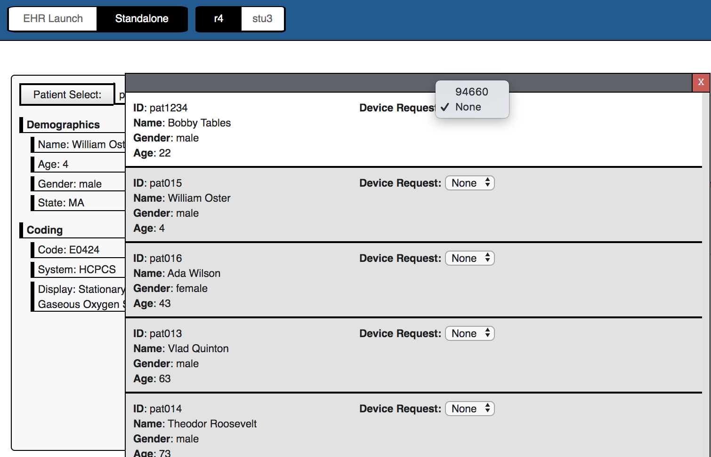

DRLS Suite on Docker
====================

Work In Progress
----------------

Note this is a work in progress!!!  Use this suite for testing the DRLS docker containers and reporting bugs to the development team.  Once everything is ready, it will be moved to the official repository.

Known bugs

* SmartApp does not launch from docker containers

Getting Started
---------------

### Pre-Requisites

You need to have the following installed:

1. git
2. [Docker](http://docker.io)

Clone or download this project, then start up the entire DRLS suite with:

`docker-compose up`

You will see the output from all the services mixed together in the console. Once the output for the init sequence for each app completes (about 3 minutes), you will be able to reach all of the services via a browser:

| URL                   | `service_name` | Description |
|-----------------------|----------|-------------|
| http://localhost:8090 | `crd`      | Coverage Requirements Discovery (CRD) Reference Implementation (RI) |
| http://localhost:8080/test-ehr | `test-ehr` | Electronic Health Record (EHR) Server |
| http://localhost:8180 | `keycloak` | [Identity and Access Management](https://www.keycloak.org/about.html) |
| http://localhost:3000 | `crd-request-generator` | Small application to generate CRD requests |
| http://localhost:3005 | `dtr` | Documentation Templates and Rules (DTR) - SMART on FHIR Application |
| http://localhost:3009 | `admin` | DRLS Admin server |

* To see the logs of an individual service, run `docker-compose logs <service_name>` in a separate console
* To stop the entire DRLS suite and remove the stopped containers, run `docker-compose down` in a separate console

### Adding Test Resources

The DRLS suite is empty by default.  To add resources:

1. Wait for all the services to finish running (about 3 minutes).  They are finished running when the console logs stops scrolling.
2. Point a browser to the [upload resource](http://localhost:3009/init_ehr) page.  This will trigger an upload of the default set of resources to the `test-ehr` server.
3. When the page responds with `done`, you should be able to see a list of resources added to the EHR by going to the [search patients page](http://localhost:8080/test-ehr/search?serverId=home&pretty=true&resource=Patient).
4. To fully test that the DRLS Suite is up and running
   1. Point a browser to http://localhost:3000
   2. Click on the `Standalone` and `R4` buttons to use the DRLS Suite's R4 server
   3. Click on `Patient Select` and you should see the following screen 

### Configurations and Customizations

The easiest way to run the DRLS Suite is to get the docker images from docker hub and orchestrate the images using the docker-compose.yml file included in the root project. Along with the docker-compose.yml file is a `.env` file. (Note this file may be invisible in your file system, you will need to do a `ls -a` to see it.)  The `.env` file contains all the environment variables that you can change to customize the suite.

These 2 files provide the defaults for running the DRLS suite for a local development machine.  If you choose, you can customize the suite in the .env file, or append the configuration before the in the command line, (e.g., `DRLS_NAMESPACE=XYZ docker-compose up`, where `XYZ` is your custom namespace)

### Additional Useful Commands for Developers

In general, running `docker-compose <command>` will run show the output of `<command>` for things running in the DRLS suite.  For example,

* `docker-compose logs <service_name>` will show the `stdout` and `stderr` for the specified `<service_name>`
* `docker-compose ps` will show all containers currently running in the DRLS suite. (You can also use `docker ps` which will show all containers running in your system.  And of course, running `ps`, will show all processes running in your system.)
* `docker-compose top` will show all running threads associated the DRLS suite

Technology Dependency
---------------------

Since we are eventually deploying to Portainer, we are matching the container technology stack used there, specifically,

* Docker Compose 2 (follow [issue 1](https://github.com/portainer/portainer/issues/2986), [issue 2](https://github.com/portainer/portainer/issues/2054), and see the [To Do](#to-do) section below)
  * Used [this template project](https://github.com/portainer/portainer-compose) as starting point for the compose files

To Do
-----

* Docker Compose 3 is apparently now supported by portainer, but only for swarms.  Once we have all the services dockerized, we'll explore this.  For now, we're sticking to just version 2
